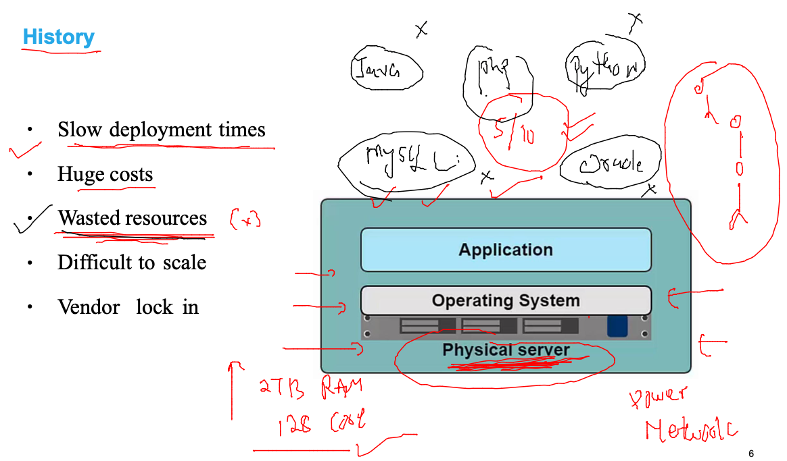
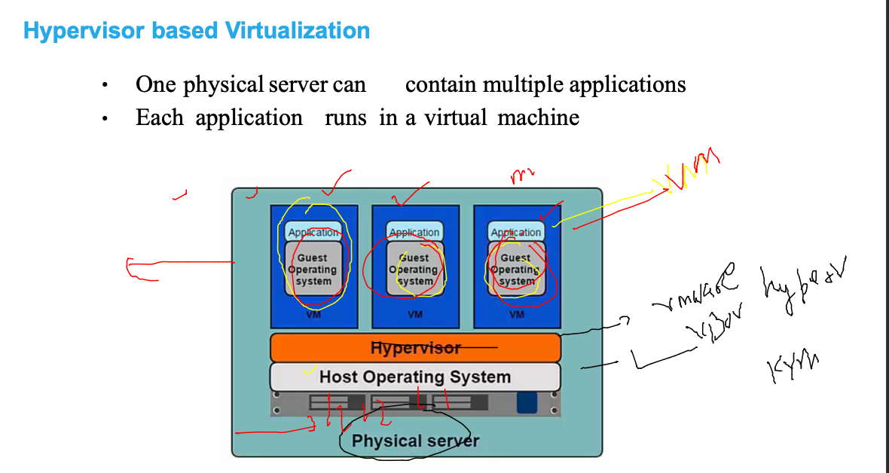
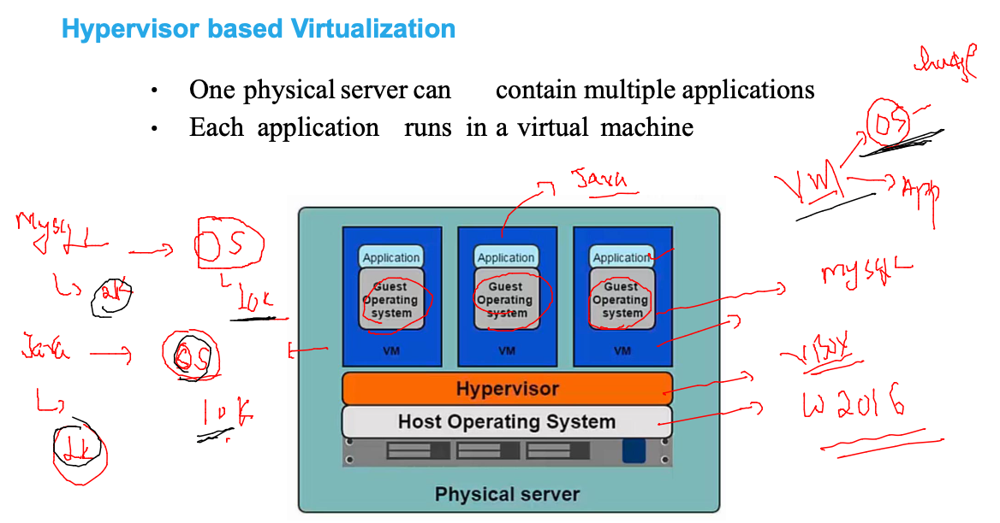
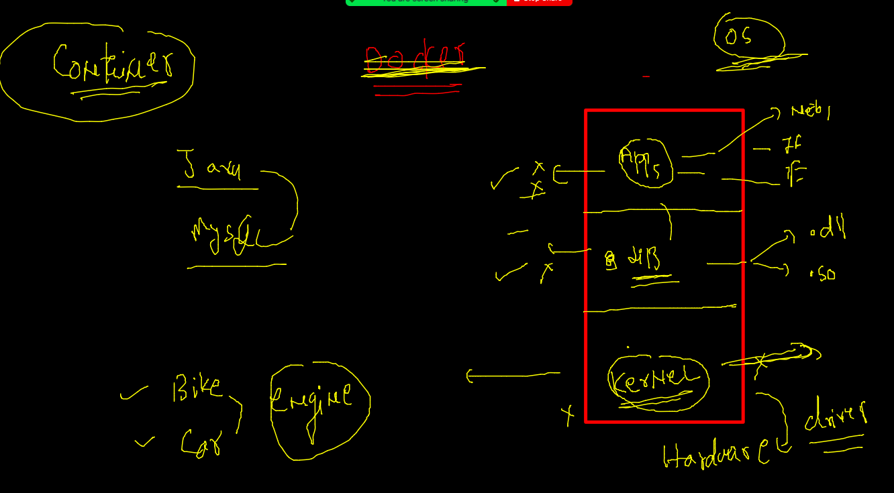
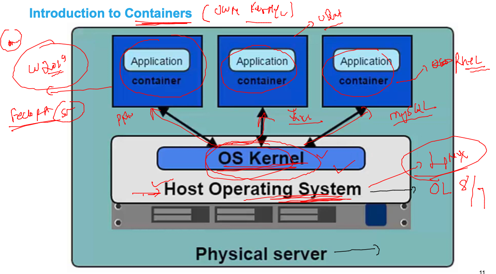
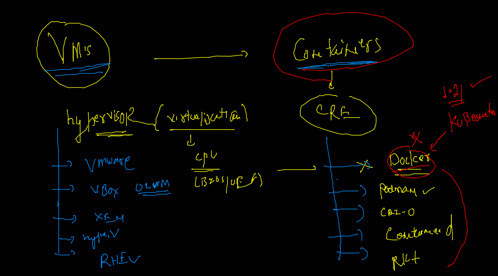
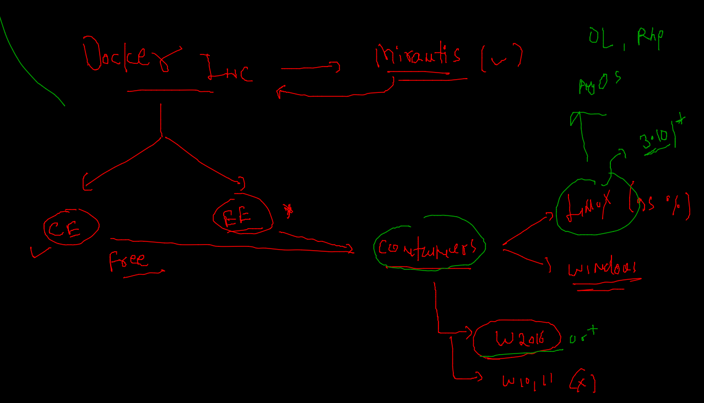
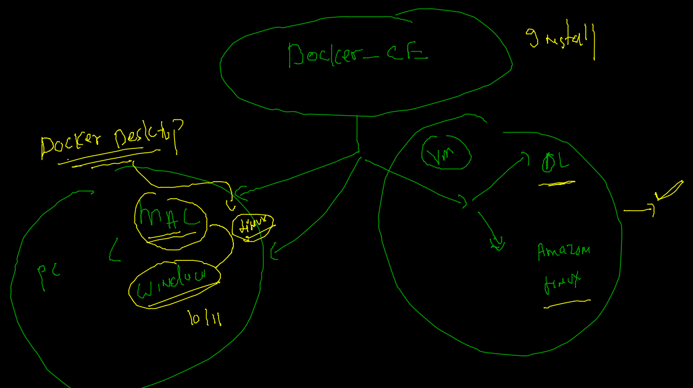
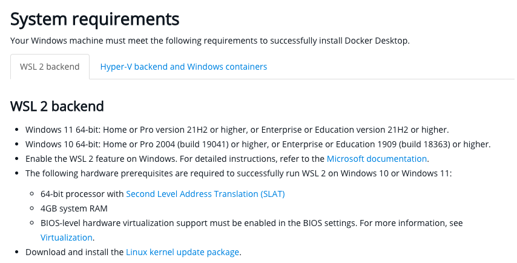
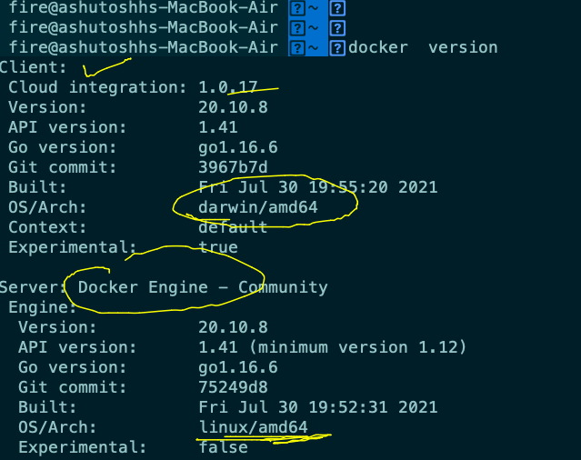

# Requested topics 

## app testing / deployment issues in bare-metal system 

### bare-metal solution by Hypervisor 

### VM issues 

### OS 

### Intro to containers 

### CRE vs Hypervisors 

## Docker Installation -- 

### Docker Dekstop 

### Docker Desktop for MAC 

[Docker Desktop](https://hub.docker.com/editions/community/docker-ce-desktop-mac)

### for windows 10 / 11 Docker requirements

### Docker installation checking on mac / windows 

