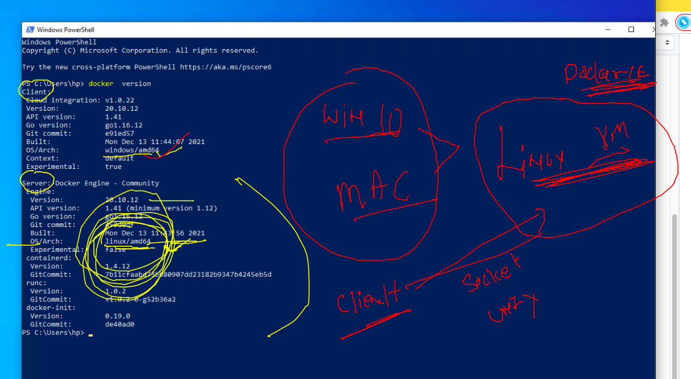

# Requested topics 


## app testing / deployment issues in bare-metal system 


### bare-metal solution by Hypervisor 


### VM issues 


### OS 


### Intro to containers 


### CRE vs Hypervisors 


## Docker Installation -- 


### Docker Dekstop 


### Docker Desktop for MAC 

[Docker Desktop](https://hub.docker.com/editions/community/docker-ce-desktop-mac)

### for windows 10 / 11 Docker requirements


### Docker installation checking on mac / windows 


## Docker on windows and mac Installation architecture 




## DOcker ce installation on OL 7 

### step 1 

```
 
[root@ol7 ~]# yum  update -y
Failed to set locale, defaulting to C
Loaded plugins: langpacks, ulninfo
ol7_MySQL80                                                                   | 3.0 kB  00:00:00     
ol7_MySQL80_connectors_community                                              | 2.9 kB  00:00:00     
ol7_MySQL80_tools_community                                                   | 2.9 kB  00:00:00     
ol7_UEKR6                                                                     | 3.0 kB  00:00:00     
ol7_addons                                                                    | 3.0 kB  00:00:00     
ol7_ksplice                                                                   | 3.0 kB  00:00:00     
ol7_latest                        

```

### install docker-engine 

```
 yum  install  docker-engine 
Failed to set locale, defaulting to C
Loaded plugins: langpacks, ulninfo
Resolving Dependencies
--> Running transaction check
---> Package docker-engine.x86_64 0:19.03.11.ol-13.el7 will be installed
--> Processing Dependency: container-selinux >= 2:2.77 for package: docker-engine-19.03.11.ol-13.el7.x86_64
--> Processing Dependency: containerd >= 1.4.8 for package: docker-engine-19.03.11.ol-13.el7.x86_64
--> Processing Dependency: runc >= 3:1.0.0-1.

```

### step 3 start docker engine service 

```
  8  yum  install  docker-engine 
    9  history 
[root@ol7 ~]# systemctl start  docker 
[root@ol7 ~]# systemctl enable  docker 
Created symlink from /etc/systemd/system/multi-user.target.wants/docker.service to /usr/lib/systemd/system/docker.service.
[root@ol7 ~]# systemctl status  docker 
● docker.service - Docker Application Container Engine
   Loaded: loaded (/usr/lib/systemd/system/docker.service; enabled; vendor preset: disabled)
   Active: active (running) since Mon 2022-01-24 06:31:20 GMT; 15s ago
     Docs: https://docs.docker.com
 Main PID: 22034 (dockerd)
   CGroup: /system.slice/docker.service
   
```


