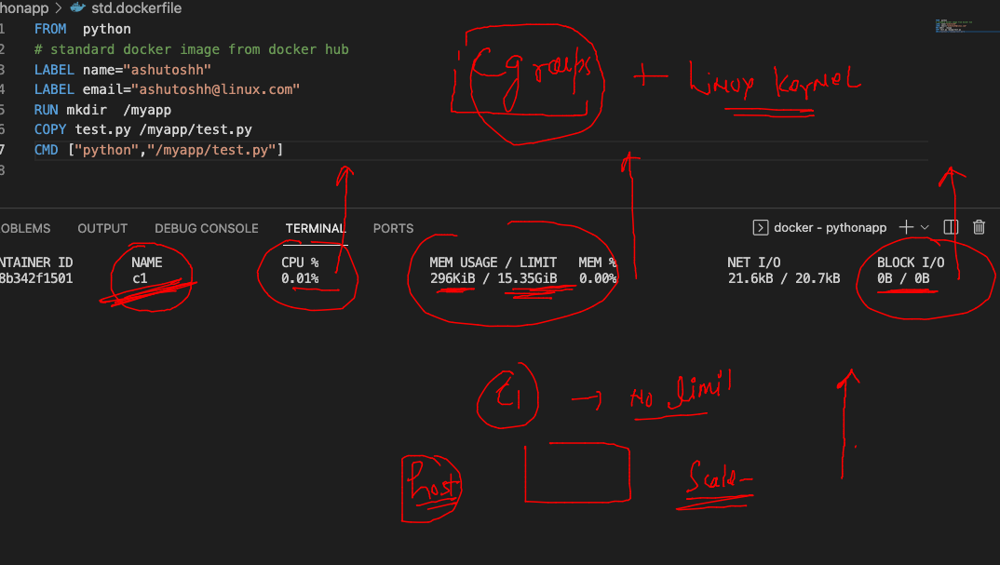
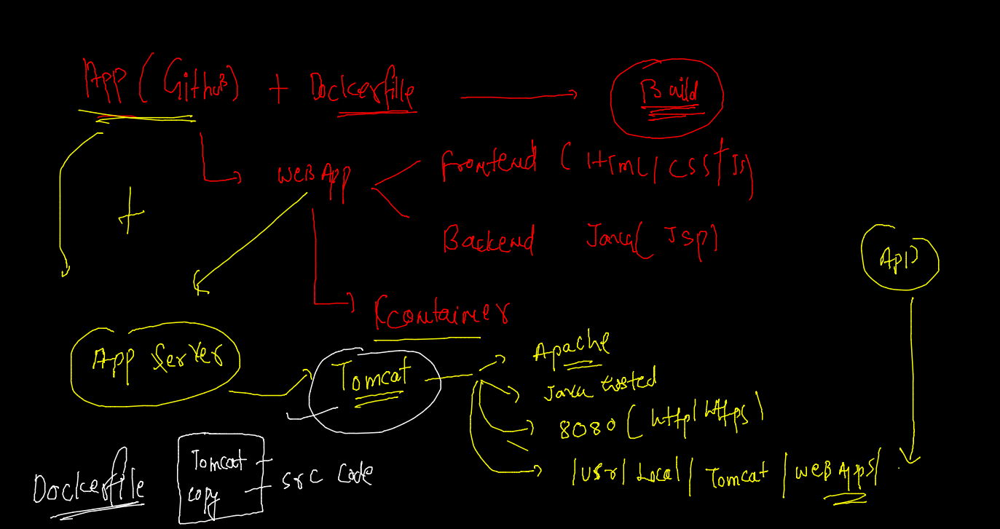
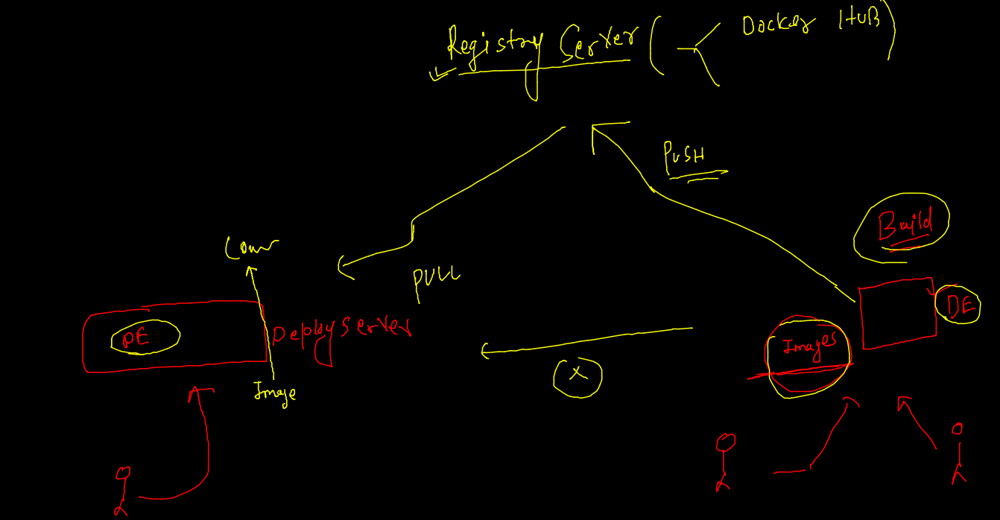
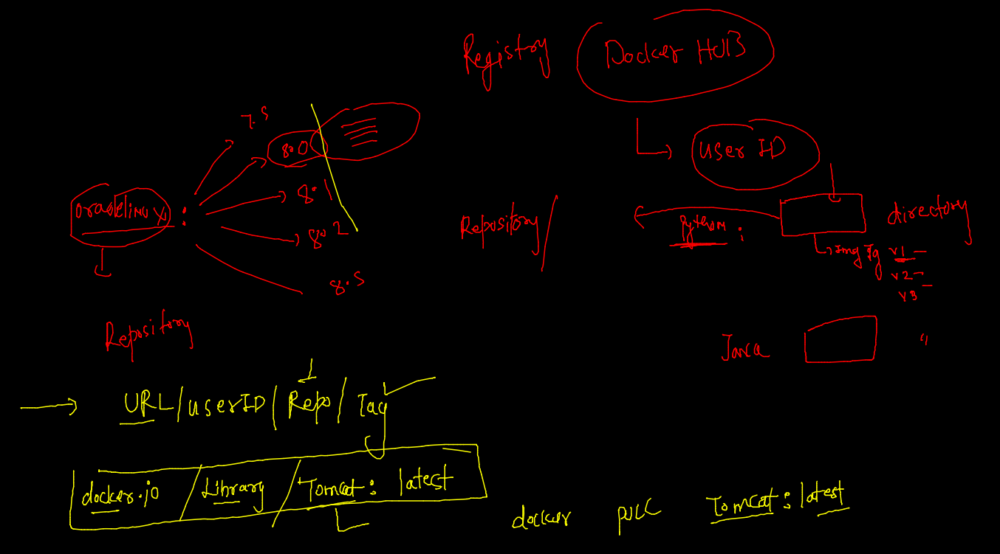
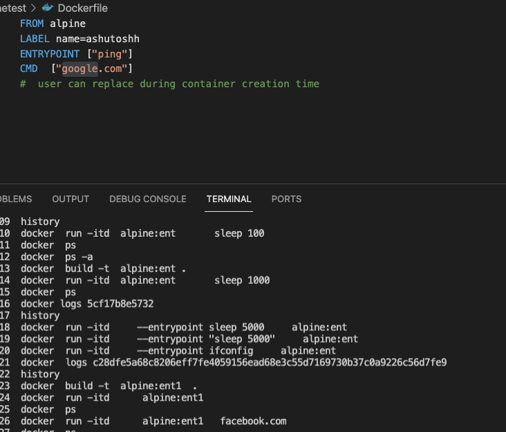

# Requested topics 


## Docker day1 Revision 


## SEtup Docker engine for non root users 

```
 2  yum install docker -y
    3  systemctl enable --now docker 
    4  systemctl status docker 
    5  for  i  in  ashu banerjee gunjan jagadhish kamlesh karthik kiran nikhil prabhath ravi shilpa subash sukumar ; do useradd $i ; usermod -aG docker $i; echo "Docker@099"  |  passwd $i --stdin ; done
    6  useradd pavan 
    7  usermod -aG docker pavan 
    8  echo "Docker@099"  |  passwd pavan --stdin 
    9  vim /etc/ssh/sshd_config 
   10  systemctl restart docker
   11  systemctl restart sshd

```

### building first Docker image 

```
[ashu@oraclede dockerimages]$ ls
pythonapp
[ashu@oraclede dockerimages]$ cd  pythonapp/
[ashu@oraclede pythonapp]$ ls
Dockerfile  test.py
[ashu@oraclede pythonapp]$ docker  build -t  ashupy:imgv1  . 
Sending build context to Docker daemon  3.584kB
Step 1/7 : FROM  oraclelinux:8.4
 ---> 97e22ab49eea
Step 2/7 : LABEL name="ashutoshh"
 ---> Using cache
 
 ```
 
### creating first container from custom image 

```
docker run -it -d  --name  ashuc1  ashupy:imgv1  
14c720e12061ff34e864b94fea09b87c23574d68d2ca3f851077af92a5748759
[ashu@oraclede pythonapp]$ docker ps
CONTAINER ID        IMAGE               COMMAND                  CREATED             STATUS              PORTS               NAMES
a37ec6f9e84a        prabhathpy:v1       "python3 /myapp/test…"   5 seconds ago       Up 4 seconds                            prabhathc1
14c720e12061        ashupy:imgv1        "python3 /myapp/test…"   7 seconds ago       Up 6 seconds                            ashuc1

```


### capture output of container programe 

```
25  docker  logs  ashuc1 
   26  docker  logs  -f ashuc1 
   
```

### kill all running containers

```
 docker  ps   -q
3ec94fd45b26
337c3ce79045
6d7dfe23b658
d44508609a1a
16ba8d1a7f05
e3ac62e17e20
c71901c136d4
70d03c48db57
18ababd5b19c
[ashu@oraclede pythonapp]$ docker  kill $(docker  ps   -q)
3ec94fd45b26
337c3ce79045
6d7dfe23b658

```

### few more tips 

```
  docker  kill $(docker  ps   -q)
   34  docker  ps  
   35  docker  ps  -a
   36  docker  ps  -a -q
   37  docker  start   $(docker  ps  -a -q)
   38  docker ps
   39  docker  kill $(docker  ps   -q)
   40  docker  rm  $(docker  ps   -qa)
   
```

### building image 

```
]$ ls
pythonapp
[ashu@oraclede dockerimages]$ cd pythonapp/
[ashu@oraclede pythonapp]$ ls
Dockerfile  std.dockerfile  test.py
[ashu@oraclede pythonapp]$ docker  build  -t  ashupy:imgv2  -f  std.dockerfile   .
Sending build context to Docker daemon  4.608kB
Step 1/6 : FROM  python
Trying to pull repository docker.io/library/python ... 
latest: Pulling from docker.io/library/python
0e29546d541c: Pull complete 
9b829c73b52b: Pull complete 
cb5b7ae36172: Pull complete 
6494e4811622: Pull complete 
6f9f74896dfa: Extracting [========================================>          ]  158.2MB/196.5MB
fcb6d5f7c986: Download complete 
3445db4c939c: Download complete 
def920d3ef5d: Download complete 

```

## cgroups 



### Memory limit for containers --- 

```
docker stats:?

=====

CONTAINER ID        NAME                CPU %               MEM USAGE / LIMIT     MEM %               NET I/O             BLOCK I/O           PIDS
1cd6b0fafbb8        jsh                 0.01%               292KiB / 50MiB        0.57%               9.45kB / 8.61kB     0B / 0B             1
57a5a9a5344a        c2                  0.01%               292KiB / 50MiB        0.57%               11.2kB / 10.3kB     0B / 0B             1
5b8b342f1501        c1                  0.01%               296KiB / 15.35GiB     0.00%               109kB / 108kB       0B / 0B             1
37cee877f8b1        kamleshcont1        0.00%               3.461MiB / 15.35GiB   0.02%               1.2kB / 0B          0B / 0B             1
9f1658386633        kircont             0.01%               5.402MiB / 15.35GiB   0.03%               1.27kB / 0B         0B / 20.5kB         1
b96225500ef4        ravi2               0.00%               4.863MiB / 15.35GiB   0.03%               1.27kB / 0B         0B / 20.5kB         1
^C
[ashu@oraclede pythonapp]$ docker  run -itd --name  c2  --memory 50m  alpine ping  google.com 


```

### More cgroups examples 

```
[ashu@oraclede pythonapp]$ docker  run -itd --name  limio  --device-read-bps /dev/sda:1mb  centos  bash 
Unable to find image 'centos:latest' locally
Trying to pull repository docker.io/library/centos ... 
latest: Pulling from docker.io/library/centos
a1d0c7532777: Pull complete 
Digest: sha256:a27fd8080b517143cbbbab9dfb7c8571c40d67d534bbdee55bd6c473f432b177
Status: Downloaded newer image for centos:latest
bf29d05a87262bfdb322a48cf00dc916520c551ec2ffeaffc356c9f96cee3934
[ashu@oraclede pythonapp]$ docker  run --help   |   grep -i device
      --blkio-weight-device list       Block IO weight (relative device weight) (default [])
      --device list                    Add a host device to the container
      --device-cgroup-rule list        Add a rule to the cgroup allowed devices list
      --device-read-bps list           Limit read rate (bytes per second) from a device (default [])
      --device-read-iops list          Limit read rate (IO per second) from a device (default [])
      --device-write-bps list          Limit write rate (bytes per second) to a device (default [])
      --device-write-iops list         Limit write rate (IO per second) to a device (default [])
      --gpus gpu-request               GPU devices to add to the container ('all' to pass all GPUs)
      
```

### 

```
 docker  run -itd --name  c3  --memory 50m  --cpus=1  --cpu-shares=20   alpine ping  google.com 
 
```

### DockerFile with tomcat 



### Image building with Source code github 

```

 fire@ashutoshhs-MacBook-Air  ~  docker  build -t  ashutomcat:v2 https://github.com/redashu/javawebapp.git
[+] Building 60.7s (3/8)                                                                                                     
 => [internal] load git source https://github.com/redashu/javawebapp.git                                                1.4s
 => [internal] load metadata for docker.io/library/tomcat:latest                                                        5.0s
 => [auth] library/tomcat:pull token for registry-1.docker.io                                                           0.0s 
 => [1/5] FROM docker.io/library/tomcat@sha256:90bd265035f2662fa7b882a25f3e20268f7b36babba830852fca3df1e1d063ab        54.2s 
 => => resolve docker.io/library/tomcat@sha256:90bd2
 
```

### Docker. Hub -- 



## Repo concept in docker hub 



## pushing image to docker HUb 

### create repo in docker webui login 

### tag docker host image in std format 

```
docker  tag  ashutomcat:v1  docker.io/dockerashu/oracleappsjan2022:v1

```

### login to docker hub from client machine 

```
docker  login  
Login with your Docker ID to push and pull images from Docker Hub. If you don't have a Docker ID, head over to https://hub.docker.com to create one.
Username: dockerashu
Password: 
WARNING! Your password will be stored unencrypted in /home/ashu/.docker/config.json.
Configure a credential helper to remove this warning. See
https://docs.docker.com/engine/reference/commandline/login/#credentials-store

Login Succeeded

```

### pushing image

```

[ashu@oraclede dockerimages]$ docker  push  docker.io/dockerashu/oracleappsjan2022:v1
The push refers to repository [docker.io/dockerashu/oracleappsjan2022]
f4a460a28d40: Pushed 
5365a6a51e77: Pushed 
7284fcb11e9d: Mounted from library/tomcat 
6987b0a3f02e: Mounted from library/tomcat 
59c516e5b6fa: Mounted from library/tomcat 
3bb5258f46d2: Mounted from library/tomcat 
832e177bb500: Mounted from library/tomcat 
f9e18e59a565: Mounted from library/tomcat 

```

### From another docker engine we can pull it 

```
 
 fire@ashutoshhs-MacBook-Air  ~  docker  pull   dockerashu/oracleappsjan2022:v1 
v1: Pulling from dockerashu/oracleappsjan2022
0e29546d541c: Downloading [=========>                                         ]  10.75MB/54.92MB
9b829c73b52b: Download complete 
cb5b7ae36172: Download complete 
6494e4811622: Waiting 
668f6fcc5fa5: Waiting 
dc120c3e0290: Waiting 
8f7c0eebb7b1: Waiting 
77b694f83996: Waiting 
a8f0d55f21c2: Waiting 
857166b62264: Waiting 
ea9ded40e16e: Wait

```

## Image pushing to OCR 

```
 docker  tag  ashutomcat:v1       phx.ocir.io/axmbtg8judkl/tomcat:appv1  
[ashu@oraclede dockerimages]$ 
[ashu@oraclede dockerimages]$ 


[ashu@oraclede dockerimages]$ docker  login   phx.ocir.io  
Username: axmbtg8judkl/learntechbyme@gmail.com
Password: 
WARNING! Your password will be stored unencrypted in /home/ashu/.docker/config.json.
Configure a credential helper to remove this warning. See
https://docs.docker.com/engine/reference/commandline/login/#credentials-store

Login Succeeded

===


[ashu@oraclede dockerimages]$ docker  push  phx.ocir.io/axmbtg8judkl/tomcat:appv1
The push refers to repository [phx.ocir.io/axmbtg8judkl/tomcat]
f4a460a28d40: Pushed 
5365a6a51e77: Pushed 
7284fcb11e9d: Pushed 

===


[ashu@oraclede dockerimages]$ docker  logout  phx.ocir.io 
Removing login credentials for phx.ocir.io
[ashu@oraclede dockerimages]$ 

```

### pulling image

```

 fire@ashutoshhs-MacBook-Air  ~     docker  pull  phx.ocir.io/axmbtg8judkl/tomcat:appv1 
Error response from daemon: Head "https://phx.ocir.io/v2/axmbtg8judkl/tomcat/manifests/appv1": unknown: Unauthorized
 ✘ fire@ashutoshhs-MacBook-Air  ~  


```

### CMD vs Entrypoint 




