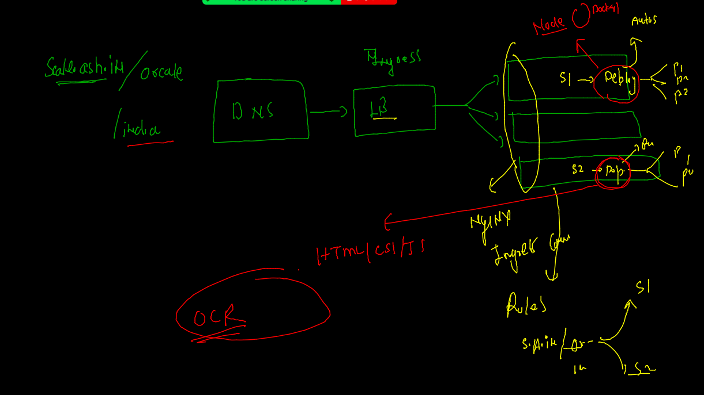

# Requested topics 


## Controllers in k8s 


## Replication controller in k8s 

### Deployment using 


### cleaning namespaces ---

```

 fire@ashutoshhs-MacBook-Air  ~/Desktop/k8sapps  kubectl  config get-contexts 
CURRENT   NAME                          CLUSTER      AUTHINFO           NAMESPACE
*         kubernetes-admin@kubernetes   kubernetes   kubernetes-admin   ashu-project
 fire@ashutoshhs-MacBook-Air  ~/Desktop/k8sapps  kubectl get  all
No resources found in ashu-project namespace.
 fire@ashutoshhs-MacBook-Air  ~/Desktop/k8sapps  kubectl  delete all --all
No resources found
 fire@ashutoshhs-MacBook-Air  ~/Desktop/k8sapps  

```
### Deployment creationg 

### Templates in deploy 


### Deployment creation --

```
kubectl  apply -f  nodedeploy.yaml
deployment.apps/ashuapp created
 fire@ashutoshhs-MacBook-Air  ~/Desktop/k8sapps  kubectl  get deployment
NAME      READY   UP-TO-DATE   AVAILABLE   AGE
ashuapp   1/1     1            1           38s
 fire@ashutoshhs-MacBook-Air  ~/Desktop/k8sapps  kubectl  get deploy    
NAME      READY   UP-TO-DATE   AVAILABLE   AGE
ashuapp   1/1     1            1           49s
 fire@ashutoshhs-MacBook-Air  ~/Desktop/k8sapps  kubectl  get  po   
NAME                       READY   STATUS    RESTARTS   AGE
ashuapp-85d97994f9-8hggg   1/1     Running   0          60s

```

### Replication controller will maintain copy of pod --

```
kubectl delete pod ashuapp-85d97994f9-8hggg
pod "ashuapp-85d97994f9-8hggg" deleted
 fire@ashutoshhs-MacBook-Air  ~/Desktop/k8sapps  kubectl  get  po -o wide                    
NAME                       READY   STATUS    RESTARTS   AGE   IP               NODE    NOMINATED NODE   READINESS GATES
ashuapp-85d97994f9-vw8kj   1/1     Running   0          25s   192.168.135.20   node3   <none>           <none>

```

### manual scaling --

```
      4m59s
 fire@ashutoshhs-MacBook-Air  ~/Desktop/k8sapps  kubectl  scale  deployment  ashuapp  --replicas=3 
deployment.apps/ashuapp scaled
 fire@ashutoshhs-MacBook-Air  ~/Desktop/k8sapps  kubectl  get po 
NAME                       READY   STATUS    RESTARTS   AGE
ashuapp-85d97994f9-2w5kl   1/1     Running   0          7s
ashuapp-85d97994f9-sphq2   1/1     Running   0          7s
ashuapp-85d97994f9-vw8kj   1/1     Running   0          7m54s
 fire@ashutoshhs-MacBook-Air  ~/Desktop/k8sapps  kubectl  get po -o wide
NAME                       READY   STATUS    RESTARTS   AGE     IP                NODE    NOMINATED NODE   READINESS GATES
ashuapp-85d97994f9-2w5kl   1/1     Running   0          12s     192.168.104.60    node2   <none>           <none>
ashuapp-85d97994f9-sphq2   1/1     Running   0          12s     192.168.166.139   node1   <none>           <none>
ashuapp-85d97994f9-vw8kj   1/1     Running   0          7m59s   192.168.135.20    node3   <none>           <none>

```

### service creation method --


```
 
 fire@ashutoshhs-MacBook-Air  ~/Desktop/k8sapps  kubectl  get  deploy 
NAME      READY   UP-TO-DATE   AVAILABLE   AGE
ashuapp   3/3     3            3           16m
 fire@ashutoshhs-MacBook-Air  ~/Desktop/k8sapps  kubectl  get  svc
No resources found in ashu-project namespace.
 fire@ashutoshhs-MacBook-Air  ~/Desktop/k8sapps  kubectl  expose deployment  ashuapp --type NodePort --port 3000 --name  ashusvc1                           
service/ashusvc1 exposed
 fire@ashutoshhs-MacBook-Air  ~/Desktop/k8sapps  kubectl  get  svc 
NAME       TYPE       CLUSTER-IP     EXTERNAL-IP   PORT(S)          AGE
ashusvc1   NodePort   10.111.33.32   <none>        3000:31148/TCP   5s

```

### Deploy custom yaml -- 

```
kubectl apply -f nodedeploy.yaml   
namespace/x1 configured
deployment.apps/ashuapp configured
service/s1 configured
 fire@ashutoshhs-MacBook-Air  ~/Desktop/k8sapps  kubectl  get  deploy,pod,svc -n x1 
NAME                      READY   UP-TO-DATE   AVAILABLE   AGE
deployment.apps/ashuapp   1/1     1            1           58s

NAME                           READY   STATUS    RESTARTS   AGE
pod/ashuapp-85d97994f9-l58k9   1/1     Running   0          59s

NAME         TYPE       CLUSTER-IP     EXTERNAL-IP   PORT(S)          AGE
service/s1   NodePort   10.96.80.203   <none>        1234:31277/TCP   58s
 fire@ashutoshhs-MacBook-Air  ~/Desktop/k8sapps  kubectl delete  -f nodedeploy.yaml
namespace "x1" deleted
deployment.apps "ashuapp" deleted
service "s1" deleted

```
## Ingress example 



### pushing image to OCR --

```
docker images
REPOSITORY               TAG       IMAGE ID       CREATED         SIZE
dockerashu/oraclenginx   v1        ac0b57d4b4ad   6 minutes ago   142MB
ubuntu                   latest    d13c942271d6   3 weeks ago     72.8MB
alpine                   latest    c059bfaa849c   2 months ago    5.59MB
 fire@ashutoshhs-MacBook-Air  ~  
 fire@ashutoshhs-MacBook-Air  ~  
 fire@ashutoshhs-MacBook-Air  ~  
 fire@ashutoshhs-MacBook-Air  ~  docker  tag     ac0b57d4b4ad        phx.ocir.io/axmbtg8judkl/htmlapp:v1
 fire@ashutoshhs-MacBook-Air  ~  docker  images
REPOSITORY                         TAG       IMAGE ID       CREATED         SIZE
dockerashu/oraclenginx             v1        ac0b57d4b4ad   6 minutes ago   142MB
phx.ocir.io/axmbtg8judkl/htmlapp   v1        ac0b57d4b4ad   6 minutes ago   142MB
ubuntu                             latest    d13c942271d6   3 weeks ago     72.8MB
alpine                             latest    c059bfaa849c   2 months ago    5.59MB
 fire@ashutoshhs-MacBook-Air  ~  docker  login -u   axmbtg8judkl/learntechbyme@gmail.com  
Password: 
 ✘ fire@ashutoshhs-MacBook-Air  ~  docker  login  phx.ocir.io -u   axmbtg8judkl/learntechbyme@gmail.com  
Password: 
Login Succeeded
 fire@ashutoshhs-MacBook-Air  ~  docker push  phx.ocir.io/axmbtg8judkl/htmlapp:v1
The push refers to repository [phx.ocir.io/axmbtg8judkl/htmlapp]
a5dc12e92364: Pushing [==================================================>]  1.006MB
762b147902c0: Pushing [==================================================>]  7.168kB
235e04e3592a: Pushing [==================================================>]  3.584kB
6173b6fa63db: Pushing [==================================================>]  4.096kB

```

### Deploy above image from OCR --

```
kubectl  create  deployment  sampleapp --image=phx.ocir.io/axmbtg8judkl/htmlapp:v1   --dry-run=client -o yaml  >htmldeploy.yaml 

```

## secret in k8s --- 


### creating secret --

```
kubectl  create  secret  
Create a secret using specified subcommand.

Available Commands:
  docker-registry Create a secret for use with a Docker registry
  generic         Create a secret from a local file, directory, or literal value
  tls             Create a TLS secret

Usage:


====

kubectl  create  secret  docker-registry  ashusec  --docker-server=phx.ocir.io            --docker-username=axmbtg8judkl/learntechbyme@gmail.com  --docker-password="Z-M5w]j89Hzy.ke.fU[Y"                           secret/ashusec created
 fire@ashutoshhs-MacBook-Air  ~  kubectl  get secret 
NAME                  TYPE                                  DATA   AGE
ashusec               kubernetes.io/dockerconfigjson        1      6s
default-token-mqz52   kubernetes.io/service-account-token   3      23h

```

### ---  expose deply 

```
 
 fire@ashutoshhs-MacBook-Air  ~  kubectl  get deploy
NAME        READY   UP-TO-DATE   AVAILABLE   AGE
ashuapp     3/3     3            3           103m
sampleapp   2/2     2            2           42m
 fire@ashutoshhs-MacBook-Air  ~  kubectl  get deploy
NAME        READY   UP-TO-DATE   AVAILABLE   AGE
ashuapp     3/3     3            3           106m
sampleapp   2/2     2            2           46m
 fire@ashutoshhs-MacBook-Air  ~  kubectl  get  svc
NAME       TYPE       CLUSTER-IP     EXTERNAL-IP   PORT(S)          AGE
ashusvc1   NodePort   10.111.33.32   <none>        3000:31148/TCP   89m
 fire@ashutoshhs-MacBook-Air  ~  kubect  expose deploy sampleapp  --type NodePort --port 80 --name ashusvc2 
zsh: command not found: kubect
 ✘ fire@ashutoshhs-MacBook-Air  ~  kubectl  expose deploy sampleapp  --type NodePort --port 80 --name ashusvc2 
service/ashusvc2 exposed
 fire@ashutoshhs-MacBook-Air  ~  kubectl  get  svc 
NAME       TYPE       CLUSTER-IP      EXTERNAL-IP   PORT(S)          AGE
ashusvc1   NodePort   10.111.33.32    <none>        3000:31148/TCP   89m
ashusvc2   NodePort   10.109.155.45   <none>        80:31578/TCP     5s

```
### HPA 

```
kubectl  get deploy      
NAME       READY   UP-TO-DATE   AVAILABLE   AGE
httpapp    1/1     1            1           26m
nginxapp   1/1     1            1           27m
 fire@ashutoshhs-MacBook-Air  ~  
 fire@ashutoshhs-MacBook-Air  ~  
 fire@ashutoshhs-MacBook-Air  ~  kubectl autoscale deployment nginxapp  --min=3 --max=10  --cpu-percent=80 
horizontalpodautoscaler.autoscaling/nginxapp autoscaled
 fire@ashutoshhs-MacBook-Air  ~  
 fire@ashutoshhs-MacBook-Air  ~  kubectl autoscale deployment httpapp  --min=2 --max=20  --cpu-percent=80 
horizontalpodautoscaler.autoscaling/httpapp autoscaled
 fire@ashutoshhs-MacBook-Air  ~  
 fire@ashutoshhs-MacBook-Air  ~  kubectl get  hpa
NAME       REFERENCE             TARGETS         MINPODS   MAXPODS   REPLICAS   AGE
httpapp    Deployment/httpapp    <unknown>/80%   2         20        0          5s
nginxapp   Deployment/nginxapp   <unknown>/80%   3         10        1          18s
 fire@ashutoshhs-MacBook-Air  ~  kubectl get  deploy 
NAME       READY   UP-TO-DATE   AVAILABLE   AGE
httpapp    1/1     1            1           28m
nginxapp   3/3     3            3           28m
 fire@ashutoshhs-MacBook-Air  ~  kubectl get  deploy 
NAME       READY   UP-TO-DATE   AVAILABLE   AGE
httpapp    2/2     2            2           28m
nginxapp   3/3     3            3           28m


```

### SSL understanding --


### creating self sign cert 

```
openssl req -x509 -newkey rsa:4096 -keyout private.pem -out  ashuweb.cert -days  365  -nodes 
Generating a 4096 bit RSA private key
................++
....................................................++
writing new private key to 'private.pem'
-----
You are about to be asked to enter information that will be incorporated
into your certificate request.
What you are about to enter is what is called a Distinguished Name or a DN.
There are quite a few fields but you can leave some blank
For some fields there will be a default value,
If you enter '.', the field will be left blank.
-----
Country Name (2 letter code) []:IN
State or Province Name (full name) []:RAJ
Locality Name (eg, city) []:JAIPUR
Organization Name (eg, company) []:ADHOC NETworks 
Organizational Unit Name (eg, section) []:tech
Common Name (eg, fully qualified host name) []:ashu-secure.com   
Email Address []:

```

### create secret -- to store CERT 

```
kubectl create secret tls ashuapp --cert=ashuweb.cert --key=private.pem
secret/ashuapp created
 fire@ashutoshhs-MacBook-Air  ~/Desktop  kubectl get secret 
NAME                  TYPE                                  DATA   AGE
ashuapp               kubernetes.io/tls                     2      7s
ashusec               kubernetes.io/dockerconfigjson        1      3h26m
default-token-mqz52   kubernetes.io/service-account-token   3      26h

```


