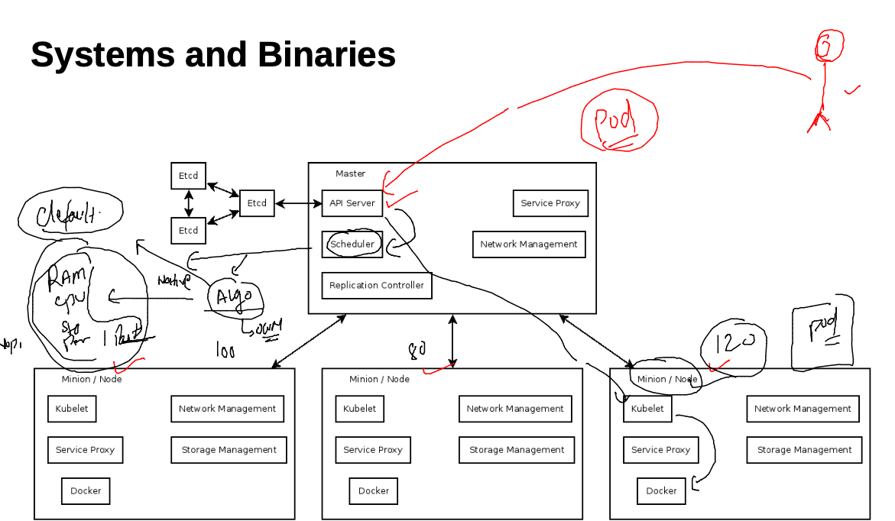

# Requested topics 


## K8s rev -- 


### Resources 


### resources list  (native)

```
kubectl version        
Client Version: version.Info{Major:"1", Minor:"22", GitVersion:"v1.22.4", GitCommit:"b695d79d4f967c403a96986f1750a35eb75e75f1", GitTreeState:"clean", BuildDate:"2021-11-17T15:48:33Z", GoVersion:"go1.16.10", Compiler:"gc", Platform:"darwin/amd64"}
Server Version: version.Info{Major:"1", Minor:"23", GitVersion:"v1.23.3", GitCommit:"816c97ab8cff8a1c72eccca1026f7820e93e0d25", GitTreeState:"clean", BuildDate:"2022-01-25T21:19:12Z", GoVersion:"go1.17.6", Compiler:"gc", Platform:"linux/amd64"}
 fire@ashutoshhs-MacBook-Air  ~/Desktop  
 fire@ashutoshhs-MacBook-Air  ~/Desktop  kubectl  api-resources 
NAME                              SHORTNAMES   APIVERSION                             NAMESPACED   KIND
bindings                                       v1                                     true         Binding
componentstatuses                 cs           v1                                     false        ComponentStatus
configmaps                        cm           v1                                     true         ConfigMap
endpoints                         ep           v1                                     true         Endpoints
events                            ev           v1                                     true         Event
limitranges                       limits       v1                                     true         LimitRange
namespaces                        ns           v1                                     false        Namespace
nodes                             no           v1              
```

## POD 

### creating our first pod 


### pod creating

```
kubectl apply -f  ashupod1.yaml
pod/ashupod-1 created
 fire@ashutoshhs-MacBook-Air  ~/Desktop/k8sapps  kubectl  get  pods
NAME           READY   STATUS    RESTARTS   AGE
ashupod-1      1/1     Running   0          11s
karthik-pod1   1/1     Running   0          27s
prabpod-1      1/1     Running   0          33s

```

## POd scheduling 



## static scheduling 


### logs of pod container 

```
9773  kubectl  logs  ashupod-1  
 9774  kubectl  logs -f  ashupod-1 
 
```

### access container of pod 

```
kubectl  exec -it  ashupod-2   -- sh 
/ # cat  /etc/os-release 
NAME="Alpine Linux"
ID=alpine
VERSION_ID=3.15.0
PRETTY_NAME="Alpine Linux v3.15"
HOME_URL="https://alpinelinux.org/"
BUG_REPORT_URL="https://bugs.alpinelinux.org/"
/ # ps -e
PID   USER     TIME  COMMAND
    1 root      0:00 ping google.com
    7 root      0:00 sh
   15 root      0:00 ps -e
/ # whoami
root
/ # exit

```

### replace pod with new changes 

```
kubectl  apply -f ashupod1.yaml    
The Pod "ashupod-2" is invalid: spec.containers: Forbidden: pod updates may not add or remove containers
 ✘ fire@ashutoshhs-MacBook-Air  ~/Desktop/k8sapps  kubectl  replace -f ashupod1.yaml --force
pod "ashupod-2" deleted
pod/ashupod-2 replaced

```

### multi container pod 

```
 kubectl  exec -it  ashupod-2  -- bash 
Defaulted container "ashuc2" out of: ashuc2, ashuc1
root@ashupod-2:/# cat  /etc/os-release 
PRETTY_NAME="Debian GNU/Linux 11 (bullseye)"
NAME="Debian GNU/Linux"
VERSION_ID="11"
VERSION="11 (bullseye)"
VERSION_CODENAME=bullseye
ID=debian
HOME_URL="https://www.debian.org/"
SUPPORT_URL="https://www.debian.org/support"
BUG_REPORT_URL="https://bugs.debian.org/"
root@ashupod-2:/# exit
exit
 fire@ashutoshhs-MacBook-Air  ~  kubectl  exec -it  ashupod-2  -c  ashuc1  -- sh  
/ # 
/ # cat  /etc/os-release 
NAME="Alpine Linux"
ID=alpine
VERSION_ID=3.15.0
PRETTY_NAME="Alpine Linux v3.15"
HOME_URL="https://alpinelinux.org/"
BUG_REPORT_URL="https://bugs.alpinelinux.org/"
/ # exit

```
### Pod deletion 

```
kubectl  delete pod  ashupod-1
pod "ashupod-1" deleted
 fire@ashutoshhs-MacBook-Air  ~  kubectl  delete pod --all     
pod "abanerjee-1" deleted
pod "ashupod-2" deleted
pod "karthik-pod1" deleted
pod "kirnpod-1" deleted
pod "nikhpod-1" deleted


```

### autogen yaml /json 

```
kubectl  run  ashupod1  --image=nginx  --port 80 --dry-run=client -o yaml
apiVersion: v1
kind: Pod
metadata:
  creationTimestamp: null
  labels:
    run: ashupod1
  name: ashupod1
spec:
  containers:
  - image: nginx
    name: ashupod1
    ports:
    - containerPort: 80
    resources: {}
  dnsPolicy: ClusterFirst
  restartPolicy: Always
status: {}
 fire@ashutoshhs-MacBook-Air  ~/Desktop  kubectl  run  ashupod1  --image=alpine --command ping fb.com  --dry-run=client -o yaml
apiVersion: v1
kind: Pod
metadata:
  creationTimestamp: null
  labels:
    run: ashupod1


```


===

```
 kubectl  run  ashupod1  --image=nginx  --port 80 --dry-run=client -o yaml
 9793  kubectl  run  ashupod1  --image=alpine --command ping fb.com  --dry-run=client -o yaml
 9794  history
 9795  kubectl  run  ashupod1  --image=nginx  --port 80 --dry-run=client -o json

```


