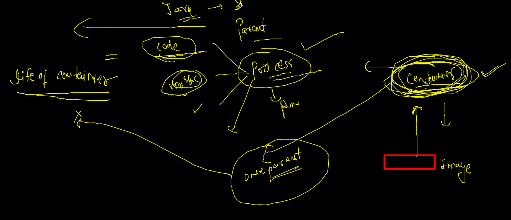
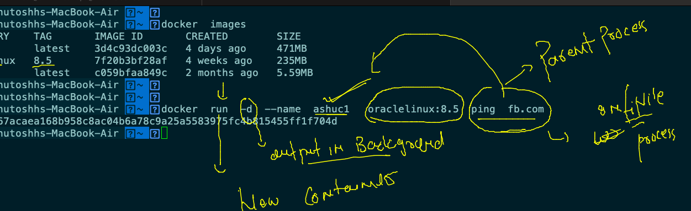

# Requested topics 


## app testing / deployment issues in bare-metal system 


### bare-metal solution by Hypervisor 


### VM issues 


### OS 


### Intro to containers 


### CRE vs Hypervisors 


## Docker Installation -- 


### Docker Dekstop 


### Docker Desktop for MAC 

[Docker Desktop](https://hub.docker.com/editions/community/docker-ce-desktop-mac)

### for windows 10 / 11 Docker requirements


### Docker installation checking on mac / windows 


## Docker on windows and mac Installation architecture 


## DOcker ce installation on OL 7 

### step 1 

```
 
[root@ol7 ~]# yum  update -y
Failed to set locale, defaulting to C
Loaded plugins: langpacks, ulninfo
ol7_MySQL80                                                                   | 3.0 kB  00:00:00     
ol7_MySQL80_connectors_community                                              | 2.9 kB  00:00:00     
ol7_MySQL80_tools_community                                                   | 2.9 kB  00:00:00     
ol7_UEKR6                                                                     | 3.0 kB  00:00:00     
ol7_addons                                                                    | 3.0 kB  00:00:00     
ol7_ksplice                                                                   | 3.0 kB  00:00:00     
ol7_latest                        

```

### install docker-engine 

```
 yum  install  docker-engine 
Failed to set locale, defaulting to C
Loaded plugins: langpacks, ulninfo
Resolving Dependencies
--> Running transaction check
---> Package docker-engine.x86_64 0:19.03.11.ol-13.el7 will be installed
--> Processing Dependency: container-selinux >= 2:2.77 for package: docker-engine-19.03.11.ol-13.el7.x86_64
--> Processing Dependency: containerd >= 1.4.8 for package: docker-engine-19.03.11.ol-13.el7.x86_64
--> Processing Dependency: runc >= 3:1.0.0-1.

```

### step 3 start docker engine service 

```
  8  yum  install  docker-engine 
    9  history 
[root@ol7 ~]# systemctl start  docker 
[root@ol7 ~]# systemctl enable  docker 
Created symlink from /etc/systemd/system/multi-user.target.wants/docker.service to /usr/lib/systemd/system/docker.service.
[root@ol7 ~]# systemctl status  docker 
● docker.service - Docker Application Container Engine
   Loaded: loaded (/usr/lib/systemd/system/docker.service; enabled; vendor preset: disabled)
   Active: active (running) since Mon 2022-01-24 06:31:20 GMT; 15s ago
     Docs: https://docs.docker.com
 Main PID: 22034 (dockerd)
   CGroup: /system.slice/docker.service
   
```

# Docker Architecture 


### Docker engine storage on LInux Host 

```
[root@ol7 docker]# cd /var/lib/docker/
[root@ol7 docker]# ls
builder  buildkit  containers  image  network  overlay2  plugins  runtimes  swarm  tmp  trust  volumes
[root@ol7 docker]# 

```

### On docker Dekstop 

```
docker  info 
Client:
 Context:    default
 Debug Mode: false
 Plugins:
  buildx: Build with BuildKit (Docker Inc., v0.6.3)
  compose: Docker Compose (Docker Inc., v2.0.0)
  scan: Docker Scan (Docker Inc., v0.8.0)

Server:
 Containers: 1
  Running: 1
  Paused: 0
  Stopped: 0
 Images: 1
 Server Version: 20.10.8
 Storage Driver: overlay2
  Backing Filesystem: extfs
  Supports d_type: true
  Native Overlay Diff: true
  userxattr: false
 Logging Driver: json-file
 Cgroup Driver: cgroupfs
 Cgroup Version: 1
 Plugins:
  Volume: local
  Network: bridge host ipvlan macvlan null overlay
  Log: awslogs fluentd gcplogs gelf journald json-file local logentries splunk syslog
 Swarm: inactive
 Runtimes: io.containerd.runc.v2 io.containerd.runtime.v1.linux runc
 Default Runtime: runc
 Init Binary: docker-init
 containerd version: e25210fe30a0a703442421b0f60afac609f950a3
 runc version: v1.0.1-0-g4144b63
 init version: de40ad0
 Security Options:
  seccomp
   Profile: default
 Kernel Version: 5.10.47-linuxkit
 Operating System: Docker Desktop
 OSType: linux
 Architecture: x86_64
 CPUs: 2
 Total Memory: 1.94GiB
 Name: docker-desktop
 ID: B5UH:IHKF:GDIR:RUIS:7JHB:BXBI:R4UQ:QGIO:OZC5:BEAJ:VKME:D3RW
 Docker Root Dir: /var/lib/docker
 Debug Mode: true


```

### Docker client side 


## app containerization 


### docker architecture done 


## Docker client side operations 

### searching images on docker hub 

```
docker search  python 
NAME                             DESCRIPTION                                     STARS     OFFICIAL   AUTOMATED
python                           Python is an interpreted, interactive, objec…   6971      [OK]       
pypy                             PyPy is a fast, compliant alternative implem…   308       [OK]       
kaggle/python                    Docker image for Python scripts run on Kaggle   158                  [OK]
nikolaik/python-nodejs           Python with Node.js                             90                   [OK]
joyzoursky/python-chromedriver   Python with Chromedriver, for running automa…   60                   [OK]
arm32v7/python                   Python is an interpreted, interactive, objec…   58                   
hylang                           Hy is a Lisp dialect that translates express…   42  

```

### pull and check images 

```
docker  pull  alpine 
Using default tag: latest
latest: Pulling from library/alpine
59bf1c3509f3: Pull complete 
Digest: sha256:21a3deaa0d32a8057914f36584b5288d2e5ecc984380bc0118285c70fa8c9300
Status: Downloaded newer image for alpine:latest
docker.io/library/alpine:latest
 fire@ashutoshhs-MacBook-Air  ~  
 fire@ashutoshhs-MacBook-Air  ~  
 fire@ashutoshhs-MacBook-Air  ~  docker  images
REPOSITORY   TAG       IMAGE ID       CREATED        SIZE
ubuntu       latest    d13c942271d6   2 weeks ago    72.8MB
alpine       latest    c059bfaa849c   2 months ago   5.59MB

```

### checking image directory structure in docker host 

```
[root@ol7 docker]# docker  images
REPOSITORY          TAG                 IMAGE ID            CREATED             SIZE
oraclelinux         8.5                 7f20b3bf28af        4 weeks ago         235MB
alpine              latest              c059bfaa849c        2 months ago        5.59MB
[root@ol7 docker]# 
[root@ol7 docker]# 
[root@ol7 docker]# 
[root@ol7 docker]# cd  /var/lib/docker/
[root@ol7 docker]# ls
builder  buildkit  containers  image  network  overlay2  plugins  runtimes  swarm  tmp  trust  volumes
[root@ol7 docker]# cd  image/
[root@ol7 image]# ls
overlay2
[root@ol7 image]# cd overlay2/
[root@ol7 overlay2]# ls
distribution  imagedb  layerdb  repositories.json
[root@ol7 overlay2]# cd  imagedb/
[root@ol7 imagedb]# ls
content  metadata
[root@ol7 imagedb]# cd content/
[root@ol7 content]# ls
sha256
[root@ol7 content]# cd  sha256/
[root@ol7 sha256]# ls
7f20b3bf28af8fe567962c2f39579436fe33c59232d95a27ab404aee89fe95e7
c059bfaa849c4d8e4aecaeb3a10c2d9b3d85f5165c66ad3a4d937758128c4d18

```

### Docker context 

```
docker  context  create   ashude  --docker host="ssh://oracle@129.146.98.159"
ashude
Successfully created context "ashude"
 fire@ashutoshhs-MacBook-Air  ~  
 fire@ashutoshhs-MacBook-Air  ~  
 fire@ashutoshhs-MacBook-Air  ~  docker  context  ls
NAME                TYPE                DESCRIPTION                               DOCKER ENDPOINT                              KUBERNETES ENDPOINT                         ORCHESTRATOR
ashude              moby                                                          ssh://oracle@129.146.98.159                                                              
default *           moby                Current DOCKER_HOST based configuration   unix:///var/run/docker.sock                  https://34.202.42.107:6443 (ashu-project)   swarm
desktop-linux       moby                                                          unix:///Users/fire/.docker/run/docker.sock                                               
 fire@ashutoshhs-MacBook-Air  ~  


```

### switching context in docker 

```
docker  images
REPOSITORY   TAG       IMAGE ID       CREATED        SIZE
openjdk      latest    3d4c93dc003c   4 days ago     471MB
ubuntu       latest    d13c942271d6   2 weeks ago    72.8MB
alpine       latest    c059bfaa849c   2 months ago   5.59MB
 fire@ashutoshhs-MacBook-Air  ~  docker  context  ls
NAME                TYPE                DESCRIPTION                               DOCKER ENDPOINT                              KUBERNETES ENDPOINT                         ORCHESTRATOR
ashude              moby                                                          ssh://oracle@129.146.98.159                                                              
default *           moby                Current DOCKER_HOST based configuration   unix:///var/run/docker.sock                  https://34.202.42.107:6443 (ashu-project)   swarm
desktop-linux       moby                                                          unix:///Users/fire/.docker/run/docker.sock                                               
 fire@ashutoshhs-MacBook-Air  ~  docker  context  use  ashude 
ashude
 fire@ashutoshhs-MacBook-Air  ~  docker  images               
REPOSITORY    TAG       IMAGE ID       CREATED        SIZE
oraclelinux   8.5       7f20b3bf28af   4 weeks ago    235MB
alpine        latest    c059bfaa849c   2 months ago   5.59MB
 fire@ashutoshhs-MacBook-Air  ~  


```

### Container creation understanding 



### tcp docker context 

```
docker  context create  newoci --docker  host="tcp://129.146.98.159:2375"
newoci
Successfully created context "newoci"
 fire@ashutoshhs-MacBook-Air  ~  docker context use newoci
newoci
 fire@ashutoshhs-MacBook-Air  ~  
 fire@ashutoshhs-MacBook-Air  ~  docker  images
Cannot connect to the Docker daemon at tcp://129.146.98.159:2375. Is the docker daemon running?
 ✘ fire@ashutoshhs-MacBook-Air  ~  
 ✘ fire@ashutoshhs-MacBook-Air  ~  
 ✘ fire@ashutoshhs-MacBook-Air  ~  docker  images
REPOSITORY    TAG       IMAGE ID       CREATED        SIZE
oraclelinux   8.5       7f20b3bf28af   4 weeks ago    235MB
alpine        latest    c059bfaa849c   2 months ago   5.59MB
 fire@ashutoshhs-MacBook-Air  ~  
 fire@ashutoshhs-MacBook-Air  ~  

```

### creating first container 



### create and list 

```

 fire@ashutoshhs-MacBook-Air  ~  docker  run  -d -it  --name  ashuc1   oraclelinux:8.5  ping  fb.com 
e9ca7acbaacff54d12be5dc1d3c73f2d834a926e3bc3a5df81bc076d4c725d51
 fire@ashutoshhs-MacBook-Air  ~  
 fire@ashutoshhs-MacBook-Air  ~  docker  ps
CONTAINER ID   IMAGE             COMMAND         CREATED          STATUS         PORTS     NAMES
fb08adc22fab   alpine            "ping fb.com"   15 seconds ago   Up 1 second              nikhc1
e9ca7acbaacf   oraclelinux:8.5   "ping fb.com"   17 seconds ago   Up 4 seconds             ashuc1
 fire@ashutoshhs-MacBook-Air  ~  


```

### list of all states containers 

```
docker  ps -a
CONTAINER ID   IMAGE             COMMAND             CREATED              STATUS                     PORTS     NAMES
9ffe2be65cd3   oraclelinux:8.5   "ping localhost"    About a minute ago   Up 59 seconds                        sukumar_first
8c577fb67c61   oraclelinux:8.4   "ps"                2 minutes ago        Exited (0) 2 minutes ago             kamleshcont2
d06ddf42bff4   oraclelinux:8.5   "top"               2 minutes ago        Up 2 minutes                         ananyo3
4d1da0ac64a3   oraclelinux:8.4   "iostat -xncz"      3 minutes ago        Created                              kamleshcont1
de34daa93b39   alpine            "ping localhost"    3 minutes ago        Up 3 minutes                         pavan3
91bf465472f5   alpine            "ping localhost"    3 minutes ago        Up 3 minutes                         nikhc1
f7faa5240ad7   alpine            "ping localhost"   

```

### to check output of container process

```
 docker  logs   ashuc1 
  docker  logs  -f ashuc1
```

### stop and start 

```
docker  stop   ashuc1 
ashuc1

---

docker  start   ashuc1 

```

### remove --

```
docker  rm  ashuc1 
ashuc1
 fire@ashutoshhs-MacBook-Air  ~  


```

### access container 

```
docker  exec  -it  shilpa1  bash 
[root@f331ccf41d09 /]# 
[root@f331ccf41d09 /]# cat /etc/os-release 
NAME="Oracle Linux Server"
VERSION="8.5"
ID="ol"
ID_LIKE="fedora"
VARIANT="Server"
VARIANT_ID="server"
VERSION_ID="8.5"
PLATFORM_ID="platform:el8"
PRETTY_NAME="Oracle Linux Server 8.5"
ANSI_COLOR="0;31"
CPE_NAME="cpe:/o:oracle:linux:8:5:server"
HOME_URL="https://linux.oracle.com/"
BUG_REPORT_URL="https://bugzilla.oracle.com/"

ORACLE_BUGZILLA_PRODUCT="Oracle Linux 8"
ORACLE_BUGZILLA_PRODUCT_VERSION=8.5
ORACLE_SUPPORT_PRODUCT="Oracle Linux"
ORACLE_SUPPORT_PRODUCT_VERSION=8.5
[root@f331ccf41d09 /]# whoami
root
[root@f331ccf41d09 /]# ls
bin  boot  dev  etc  home  lib  lib64  media  mnt  opt  proc  root  run  sbin  srv  sys  tmp  usr  var
[root@f331ccf41d09 /]# exit
exit


```


