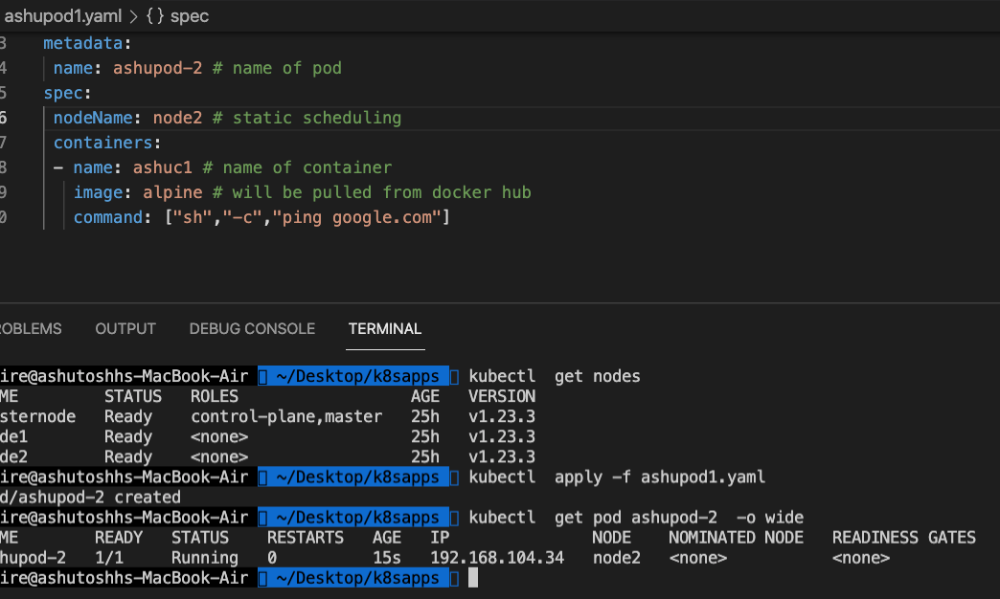
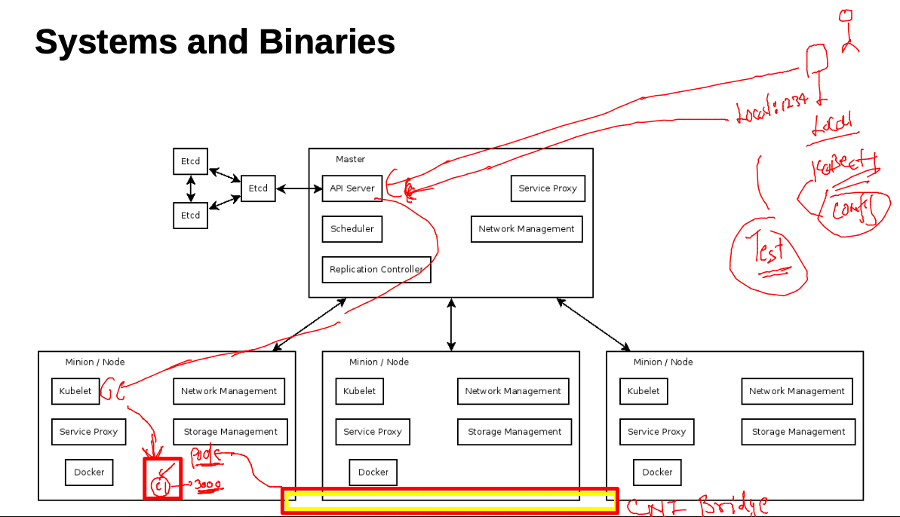
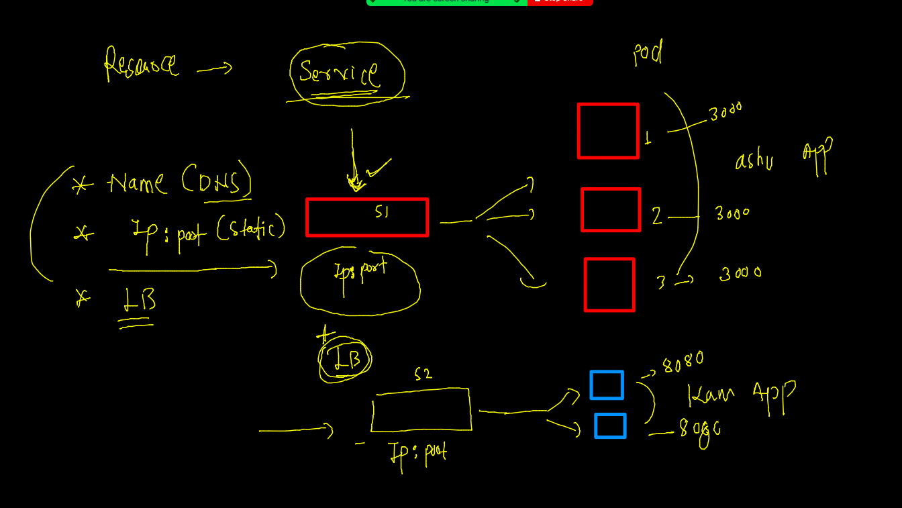
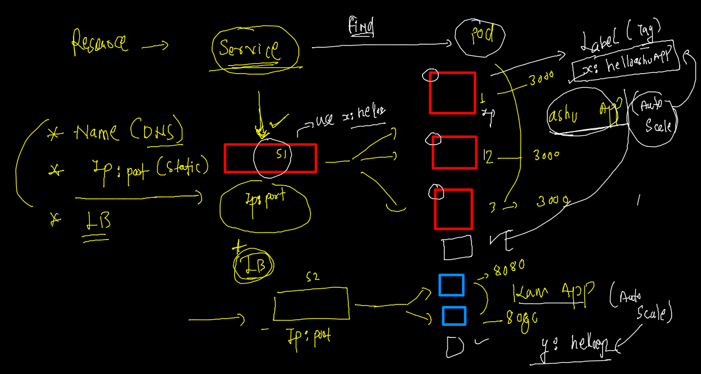
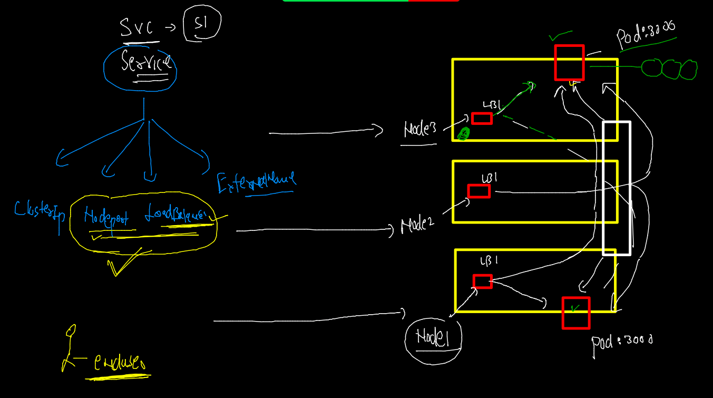
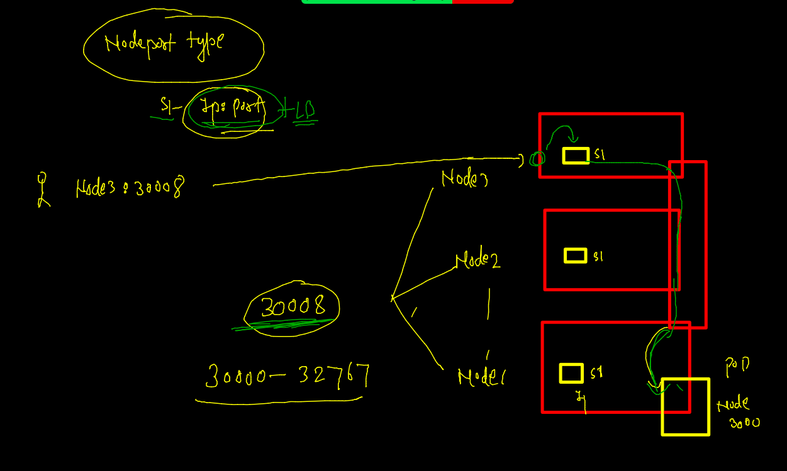
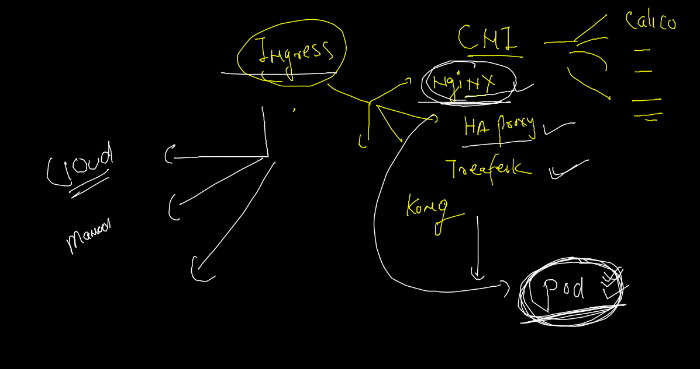

# Requested topics 


## K8s rev -- 


### Resources 


### resources list  (native)

```
kubectl version        
Client Version: version.Info{Major:"1", Minor:"22", GitVersion:"v1.22.4", GitCommit:"b695d79d4f967c403a96986f1750a35eb75e75f1", GitTreeState:"clean", BuildDate:"2021-11-17T15:48:33Z", GoVersion:"go1.16.10", Compiler:"gc", Platform:"darwin/amd64"}
Server Version: version.Info{Major:"1", Minor:"23", GitVersion:"v1.23.3", GitCommit:"816c97ab8cff8a1c72eccca1026f7820e93e0d25", GitTreeState:"clean", BuildDate:"2022-01-25T21:19:12Z", GoVersion:"go1.17.6", Compiler:"gc", Platform:"linux/amd64"}
 fire@ashutoshhs-MacBook-Air  ~/Desktop  
 fire@ashutoshhs-MacBook-Air  ~/Desktop  kubectl  api-resources 
NAME                              SHORTNAMES   APIVERSION                             NAMESPACED   KIND
bindings                                       v1                                     true         Binding
componentstatuses                 cs           v1                                     false        ComponentStatus
configmaps                        cm           v1                                     true         ConfigMap
endpoints                         ep           v1                                     true         Endpoints
events                            ev           v1                                     true         Event
limitranges                       limits       v1                                     true         LimitRange
namespaces                        ns           v1                                     false        Namespace
nodes                             no           v1              
```

## POD 

### creating our first pod 


### pod creating

```
kubectl apply -f  ashupod1.yaml
pod/ashupod-1 created
 fire@ashutoshhs-MacBook-Air  ~/Desktop/k8sapps  kubectl  get  pods
NAME           READY   STATUS    RESTARTS   AGE
ashupod-1      1/1     Running   0          11s
karthik-pod1   1/1     Running   0          27s
prabpod-1      1/1     Running   0          33s

```

## POd scheduling 


## static scheduling 



### logs of pod container 

```
9773  kubectl  logs  ashupod-1  
 9774  kubectl  logs -f  ashupod-1 
 
```

### access container of pod 

```
kubectl  exec -it  ashupod-2   -- sh 
/ # cat  /etc/os-release 
NAME="Alpine Linux"
ID=alpine
VERSION_ID=3.15.0
PRETTY_NAME="Alpine Linux v3.15"
HOME_URL="https://alpinelinux.org/"
BUG_REPORT_URL="https://bugs.alpinelinux.org/"
/ # ps -e
PID   USER     TIME  COMMAND
    1 root      0:00 ping google.com
    7 root      0:00 sh
   15 root      0:00 ps -e
/ # whoami
root
/ # exit

```

### replace pod with new changes 

```
kubectl  apply -f ashupod1.yaml    
The Pod "ashupod-2" is invalid: spec.containers: Forbidden: pod updates may not add or remove containers
 ✘ fire@ashutoshhs-MacBook-Air  ~/Desktop/k8sapps  kubectl  replace -f ashupod1.yaml --force
pod "ashupod-2" deleted
pod/ashupod-2 replaced

```

### multi container pod 

```
 kubectl  exec -it  ashupod-2  -- bash 
Defaulted container "ashuc2" out of: ashuc2, ashuc1
root@ashupod-2:/# cat  /etc/os-release 
PRETTY_NAME="Debian GNU/Linux 11 (bullseye)"
NAME="Debian GNU/Linux"
VERSION_ID="11"
VERSION="11 (bullseye)"
VERSION_CODENAME=bullseye
ID=debian
HOME_URL="https://www.debian.org/"
SUPPORT_URL="https://www.debian.org/support"
BUG_REPORT_URL="https://bugs.debian.org/"
root@ashupod-2:/# exit
exit
 fire@ashutoshhs-MacBook-Air  ~  kubectl  exec -it  ashupod-2  -c  ashuc1  -- sh  
/ # 
/ # cat  /etc/os-release 
NAME="Alpine Linux"
ID=alpine
VERSION_ID=3.15.0
PRETTY_NAME="Alpine Linux v3.15"
HOME_URL="https://alpinelinux.org/"
BUG_REPORT_URL="https://bugs.alpinelinux.org/"
/ # exit

```
### Pod deletion 

```
kubectl  delete pod  ashupod-1
pod "ashupod-1" deleted
 fire@ashutoshhs-MacBook-Air  ~  kubectl  delete pod --all     
pod "abanerjee-1" deleted
pod "ashupod-2" deleted
pod "karthik-pod1" deleted
pod "kirnpod-1" deleted
pod "nikhpod-1" deleted


```

### autogen yaml /json 

```
kubectl  run  ashupod1  --image=nginx  --port 80 --dry-run=client -o yaml
apiVersion: v1
kind: Pod
metadata:
  creationTimestamp: null
  labels:
    run: ashupod1
  name: ashupod1
spec:
  containers:
  - image: nginx
    name: ashupod1
    ports:
    - containerPort: 80
    resources: {}
  dnsPolicy: ClusterFirst
  restartPolicy: Always
status: {}
 fire@ashutoshhs-MacBook-Air  ~/Desktop  kubectl  run  ashupod1  --image=alpine --command ping fb.com  --dry-run=client -o yaml
apiVersion: v1
kind: Pod
metadata:
  creationTimestamp: null
  labels:
    run: ashupod1


```


===

```
 kubectl  run  ashupod1  --image=nginx  --port 80 --dry-run=client -o yaml
 9793  kubectl  run  ashupod1  --image=alpine --command ping fb.com  --dry-run=client -o yaml
 9794  history
 9795  kubectl  run  ashupod1  --image=nginx  --port 80 --dry-run=client -o json

```

# K8s Networking 

## Host level 


### adding new minion node 

```
 4  hostnamectl set-hostname node3
    5  yum install docker  -y 
    6  history 
    7  systemctl start  docker 
    8  systemctl enable  docker 
    9  docker  info 
   10  cat  <<X  >/etc/docker/daemon.json
{
  "exec-opts": ["native.cgroupdriver=systemd"]
}

X

   11  systemctl daemon-reload 
   12  systemctl restart docker 
   13  docker  info 
   14  history 
   15  cat  <<EOF  >/etc/yum.repos.d/kube.repo
[kube]
baseurl=https://packages.cloud.google.com/yum/repos/kubernetes-el7-x86_64
gpgcheck=0
EOF

   16  yum  install kubeadm -y
   17  history 
   18  systemctl enable --now kublet 
   19  systemctl enable --now kubelet 
   20  ping  172.31.93.200
   21  ping  52.201.159.222
   22  modprobe br_netfilter
   23  echo '1' > /proc/sys/net/bridge/bridge-nf-call-iptables
   24  kubeadm join 172.31.93.200:6443 --token yify7m.91s4e3te0eyaj3x8 --discovery-token-ca-cert-hash sha256:e09aaf11cda8095bc11ea4aa32d7cab1db63b5a01f05d8ff1371c814b119f947
   
```

## CNI -- 


### Namespaces 


### listing 

```

 fire@ashutoshhs-MacBook-Air  ~  
 fire@ashutoshhs-MacBook-Air  ~  kubectl  get  namespaces  
NAME                   STATUS   AGE
default                Active   27h
kube-node-lease        Active   27h
kube-public            Active   27h
kube-system            Active   27h
kubernetes-dashboard   Active   27h
 fire@ashutoshhs-MacBook-Air  ~  
 fire@ashutoshhs-MacBook-Air  ~  
 fire@ashutoshhs-MacBook-Air  ~  
 fire@ashutoshhs-MacBook-Air  ~  kubectl  get  pods -n  kube-node-lease 
No resources found in kube-node-lease namespace.
 fire@ashutoshhs-MacBook-Air  ~  kubectl  get  pods -n  kube-public     
No resources found in kube-public namespace.
 fire@ashutoshhs-MacBook-Air  ~  


====

kubectl  get  pods -o wide -n  kube-system 
NAME                                       READY   STATUS    RESTARTS      AGE   IP               NODE         NOMINATED NODE   READINESS GATES
calico-kube-controllers-85b5b5888d-w2pjf   1/1     Running   2 (14h ago)   27h   192.168.181.7    masternode   <none>           <none>
calico-node-gvnhm                          1/1     Running   2 (14h ago)   27h   172.31.93.200    masternode   <none>           <none>
calico-node-ksq28                          1/1     Running   0             55m   172.31.26.73     node3        <none>           <none>
calico-node-mmvxk                          1/1     Running   2 (14h ago)   27h   172.31.86.30     node2        <none>           <none>
calico-node-zsx49                          1/1     Running   2 (14h ago)   27h   172.31.93.17     node1        <none>           <none>
coredns-64897985d-mrpdj                    1/1     Running   2 (14h ago)   27h   192.168.181.9    masternode   <none>           <none>
coredns-64897985d-z68p2                    1/1     Running   2 (14h ago)   27h   192.168.181.8    masternode   <none>           <none>
etcd-masternode                            1/1     Running   2 (14h ago)   28h   172.31.93.200    masternode   <none>           <none>
kube-apiserver-masternode                  1/1     Running   2

```

### namespace creation ---

```
kubectl  create  namespace  ashu-project  --dry-run=client -o yaml
apiVersion: v1
kind: Namespace
metadata:
  creationTimestamp: null
  name: ashu-project
spec: {}
status: {}
 fire@ashutoshhs-MacBook-Air  ~  kubectl  create  namespace  ashu-project                          
namespace/ashu-project created
 fire@ashutoshhs-MacBook-Air  ~  kubectl  get  ns
NAME                   STATUS   AGE
ashu-project           Active   8s
default                Active   28h
kube-node-lease        Active   28h
kube-public            Active   28h
kube-system            Active   28h
kubernetes-dashboard   Active   28h

```

### setting default namespace --

```
kubectl  get  pods
No resources found in default namespace.
 fire@ashutoshhs-MacBook-Air  ~  kubectl  config set-context --current  --namespace=ashu-project
Context "kubernetes-admin@kubernetes" modified.
 fire@ashutoshhs-MacBook-Air  ~  kubectl   config  get-contexts 
CURRENT   NAME                          CLUSTER      AUTHINFO           NAMESPACE
*         kubernetes-admin@kubernetes   kubernetes   kubernetes-admin   ashu-project
 fire@ashutoshhs-MacBook-Air  ~  kubectl  get pods
No resources found in ashu-project namespace.
 fire@ashutoshhs-MacBook-Air  ~  

```

### nodejs based docker images 

```

```

### creating pod 
```
kubectl  run  ashunodeapp --image=dockerashu/oracle:nodeappv1   --port 3000 --dry-run=client  -o yaml  >nodeapp.yaml

```

### deploy nodeapp in personal namespace 

```
 
 fire@ashutoshhs-MacBook-Air  ~/Desktop/k8sapps  ls
ashupod1.yaml nodeapp.yaml
 fire@ashutoshhs-MacBook-Air  ~/Desktop/k8sapps  kubectl apply  -f  nodeapp.yaml 
pod/ashunodeapp created
 fire@ashutoshhs-MacBook-Air  ~/Desktop/k8sapps  kubectl  get  pods
NAME          READY   STATUS    RESTARTS   AGE
ashunodeapp   1/1     Running   0          10s

```

### access app locally

```
 
 fire@ashutoshhs-MacBook-Air  ~  kubectl  get  po 
NAME          READY   STATUS    RESTARTS   AGE
ashunodeapp   1/1     Running   0          2m31s
 fire@ashutoshhs-MacBook-Air  ~  
 fire@ashutoshhs-MacBook-Air  ~  kubectl  port-forward  ashunodeapp  1122:3000  
Forwarding from 127.0.0.1:1122 -> 3000
Forwarding from [::1]:1122 -> 3000
Handling connection for 1122
Handling connection for 1122
Handling connection for 1122
Handling connection for 1122
Handling connection for 1122
Handling connection for 1122

```

### kubectl port forward 



## Intro to service in k8s 



### service will use label to find pods 



## service type in k8s



### Nodeport service understanding 



### checking label of pod 

```
kubectl apply -f nodeapp.yaml 
pod/ashunodeapp configured
 fire@ashutoshhs-MacBook-Air  ~/Desktop/k8sapps  kubectl  get po 
NAME          READY   STATUS    RESTARTS   AGE
ashunodeapp   1/1     Running   0          134m
 fire@ashutoshhs-MacBook-Air  ~/Desktop/k8sapps  kubectl  get po  --show-labels
NAME          READY   STATUS    RESTARTS   AGE    LABELS
ashunodeapp   1/1     Running   0          134m   x=myapp1

```

### creating service of nodeport type 

```
kubectl  create  service  
Create a service using a specified subcommand.

Aliases:
service, svc

Available Commands:
  clusterip    Create a ClusterIP service
  externalname Create an ExternalName service
  loadbalancer Create a LoadBalancer service
  nodeport     Create a NodePort service

====

kubectl  create  service    nodeport   ashusvc1  --tcp  1234:3000  --dry-run=client -o yaml 
apiVersion: v1
kind: Service
metadata:
  creationTimestamp: null
  labels:
    app: ashusvc1
  name: ashusvc1
spec:
  ports:
  - name: 1234-3000
    port: 1234


```

### creating service 

```
kubectl  get  po --show-labels
NAME          READY   STATUS    RESTARTS   AGE    LABELS
ashunodeapp   1/1     Running   0          146m   x=myapp1
 fire@ashutoshhs-MacBook-Air  ~/Desktop/k8sapps  
 fire@ashutoshhs-MacBook-Air  ~/Desktop/k8sapps  kubectl  get  service 
NAME       TYPE       CLUSTER-IP     EXTERNAL-IP   PORT(S)          AGE
ashusvc1   NodePort   10.98.15.147   <none>        1234:32399/TCP   2m1s
 fire@ashutoshhs-MacBook-Air  ~/Desktop/k8sapps  kubectl  get  service -o wide
NAME       TYPE       CLUSTER-IP     EXTERNAL-IP   PORT(S)          AGE    SELECTOR
ashusvc1   NodePort   10.98.15.147   <none>        1234:32399/TCP   3m3s   x=myapp1
 fire@ashutoshhs-MacBook-Air  ~/Desktop/k8sapps  


```

## Ingress in k8s 


### Ingress options -- 



### Nginx ingress deployment URL 

[Ingress](https://kubernetes.github.io/ingress-nginx/deploy/)

### Deploy Ingress in self managed k8s 

```
 kubectl  apply -f  https://raw.githubusercontent.com/redashu/k8s/ssl/nginx-ingress-controller.yaml
 
 ===
 
 kubectl  get  all -n ingress-nginx
NAME                                            READY   STATUS      RESTARTS   AGE
pod/ingress-nginx-admission-create-5v2mj        0/1     Completed   0          62s
pod/ingress-nginx-admission-patch-m5htx         0/1     Completed   0          62s
pod/ingress-nginx-controller-65c848c6b5-t5zdj   1/1     Running     0          65s

NAME                                         TYPE        CLUSTER-IP      EXTERNAL-IP   PORT(S)                      AGE
service/ingress-nginx-controller             NodePort    10.96.203.178   <none>        80:31052/TCP,443:32501/TCP   66s
service/ingress-nginx-controller-admission   ClusterIP   10.100.78.133   <none>        443/TCP                      67s

NAME                                       READY   UP-TO-DATE   AVAILABLE   AGE
deployment.apps/ingress-nginx-controller   1/1     1            1           66s

NAME                                                  DESIRED   CURRENT   READY   AGE
replicaset.apps/ingress-nginx-controller-65c848c6b5   1         1         1       67s

NAME                                       COMPLETIONS   DURATION   AGE
job.batch/ingress-nginx-admission-create   1/1           2s         65s
job.batch/ingress-nginx-admission-patch    1/1           2s         65s
 fire@ashutoshhs-MacBook-Air  ~  
 fire@ashutoshhs-MacBook-Air  ~  
 fire@ashutoshhs-MacBook-Air  ~  kubectl  get  secret -n ingress-nginx 
NAME                                  TYPE                                  DATA   AGE
default-token-8dtf4                   kubernetes.io/service-account-token   3      86s
ingress-nginx-admission               Opaque                                3      79s
ingress-nginx-admission-token-5gp6r   kubernetes.io/service-account-token   3      82s
ingress-nginx-token-mwrv5             kubernetes.io/service-account-token   3      86s

```


