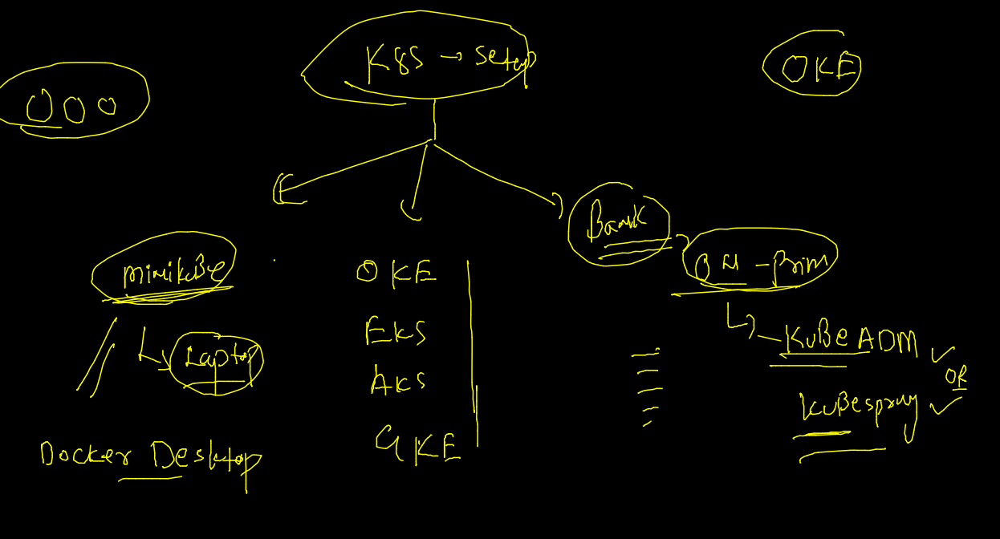
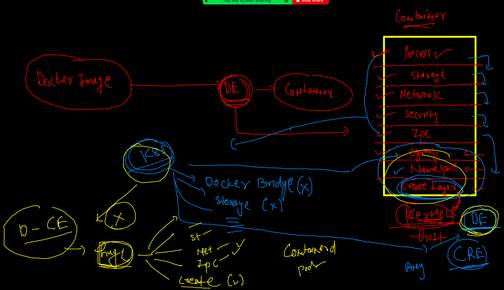

# Requested topics 


## Docker Revision 


## Deleting network 

```
[ashu@oraclede dockerimages]$ docker network ls
NETWORK ID          NAME                DRIVER              SCOPE
63b83136aa11        ashubr1             bridge              local
0f68aa3587d3        ashubr2             bridge              local
5e46659a05b1        bridge              bridge              local
56cf7a86615b        host                host                local
67cb6bee9554        none                null                local
181e0a85fdf4        subashbr1           bridge              local
673b1bbe4e31        subashbr2           bridge              local
[ashu@oraclede dockerimages]$ docker  network  rm  $(docker network  ls -q)
63b83136aa11
0f68aa3587d3
Error response from daemon: bridge is a pre-defined network and cannot be removed
Error response from daemon: host is a pre-defined network and cannot be removed
Error response from daemon: none is a pre-defined network and cannot be removed
181e0a85fdf4
673b1bbe4e31
[ashu@oraclede dockerimages]$ docker network ls
NETWORK ID          NAME                DRIVER              SCOPE
5e46659a05b1        bridge              bridge              local
56cf7a86615b        host                host                local
67cb6bee9554        none                null                local

```

### Docker None Bridge 

```

[ashu@oraclede dockerimages]$ docker  run  -it --rm  --network  none alpine 
/ # 
/ # 
/ # ifconfig 
lo        Link encap:Local Loopback  
          inet addr:127.0.0.1  Mask:255.0.0.0
          UP LOOPBACK RUNNING  MTU:65536  Metric:1
          RX packets:0 errors:0 dropped:0 overruns:0 frame:0
          TX packets:0 errors:0 dropped:0 overruns:0 carrier:0
          collisions:0 txqueuelen:1000 
          RX bytes:0 (0.0 B)  TX bytes:0 (0.0 B)

/ # ping  172.17.0.1
PING 172.17.0.1 (172.17.0.1): 56 data bytes
ping: sendto: Network unreachable
/ # ping google.com 
^C
/ # exit

```

### Docker network --

```
307  docker  run -itd  --name x1c1  alpine  
  308  docker  exec -it  x1c1 sh 
  309  history 
  310  docker  network  ls
  311  history 
  312  docker  network connect  gunjan_brx1  x1c1 
  313  docker  exec -it  x1c1 sh 
  314  history 
  315  docker  network disconnect  gunjan_brx1  x1c1 
  316  history 
  
```

### MAcVLAN 


## Overlay 


### COntiner app deployment problem 


# COntianer management  /  tools 


## K8s architecture 


### k8s client with kubectl 

[kubectl Download](https://kubernetes.io/docs/tasks/tools/)


## K8s master node components -- 


### kubeapi server --

```
kubectl  cluster-info  --kubeconfig admin.conf.txt 
Kubernetes control plane is running at https://52.201.159.222:6443
CoreDNS is running at https://52.201.159.222:6443/api/v1/namespaces/kube-system/services/kube-dns:dns/proxy

To further debug and diagnose cluster problems, use 'kubectl cluster-info dump'.

```

### get nodes 

```
kubectl  get  nodes   --kubeconfig admin.conf.txt 
NAME         STATUS   ROLES                  AGE     VERSION
masternode   Ready    control-plane,master   3h26m   v1.23.3
node1        Ready    <none>                 3h21m   v1.23.3
node2        Ready    <none>                 3h21m   v1.23.3
 fire@ashutoshhs-MacBook-Air  ~/Desktop  

```

### k8s setup



### etcd 


### copy admin.conf in .kube directory 

```
 
 fire@ashutoshhs-MacBook-Air  ~/Desktop  
 fire@ashutoshhs-MacBook-Air  ~/Desktop  cp -v  admin.conf.txt  ~/.kube/config
admin.conf.txt -> /Users/fire/.kube/config
 fire@ashutoshhs-MacBook-Air  ~/Desktop  
 fire@ashutoshhs-MacBook-Air  ~/Desktop  
 fire@ashutoshhs-MacBook-Air  ~/Desktop  
 fire@ashutoshhs-MacBook-Air  ~/Desktop  
 fire@ashutoshhs-MacBook-Air  ~/Desktop  
 fire@ashutoshhs-MacBook-Air  ~/Desktop  
 fire@ashutoshhs-MacBook-Air  ~/Desktop  
 fire@ashutoshhs-MacBook-Air  ~/Desktop  kubectl  get  nodes                               
NAME         STATUS   ROLES                  AGE     VERSION
masternode   Ready    control-plane,master   3h38m   v1.23.3
node1        Ready    <none>                 3h33m   v1.23.3
node2        Ready    <none>                 3h33m   v1.23.3

```

### configure / user kubeconfig file of k8s cluster 

```
26  kubectl  cluster-info  --kubeconfig admin.conf.txt 
 9627  kubectl  get  nodes   --kubeconfig admin.conf.txt 
 9628  cp -v  admin.conf.txt  ~/.kube/config
 9629  kubectl  get  nodes  
 9630  kubectl cluster-info 
 fire@ashutoshhs-MacBook-Air  ~/Desktop  
 fire@ashutoshhs-MacBook-Air  ~/Desktop  export KUBECONFIG=/Users/fire/Desktop/admin.conf.txt 
 
```

### kubelet in worker / minion side


### deploy in k8s 


### container 



## POD concept 


